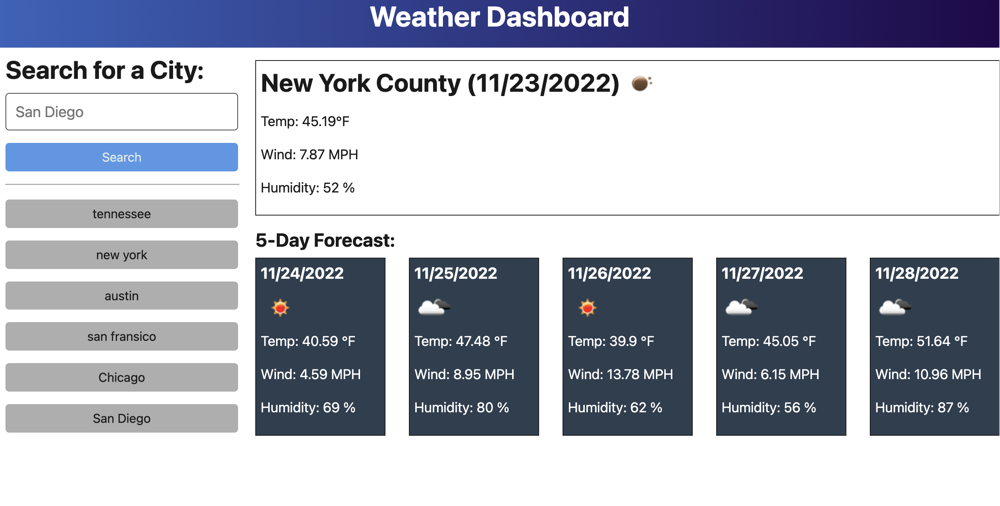

# Server-Side-APIs
Bootcamp Challenge 6

## Your Task

My task was to build an application using mainly Javascript along with HTML and CSS.

The goal was to work with a Server Side API, in this case the Open Weather Map API. I used the data I received from the API to create a 5 day forecast and current forecast of a location. This location after being searched is saved to local storage and updated on the application as a previous searched button option.

## Preview

Here is a preview of the deployed application.

## Links

https://github.com/ndifiori/Server-Side-APIs

